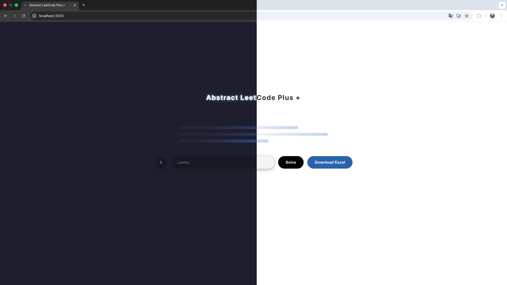

# Abstract-LeetCode-Plus

[Getting Started / 快速开始](#getting-started--快速开始)

ABSTRACT is an intelligent study and review tool designed specifically for mastering LeetCode questions. It helps users organize, summarize, and retain key problem-solving patterns efficiently. With structured note-taking, spaced repetition, and AI-powered insights, ABSTRACT makes coding interview preparation faster and more effective.

ABSTRACT 是一款专为刷 LeetCode 打造的智能学习与复习辅助工具。它能够高效帮助用户梳理、总结并固化核心解题模式。通过结构化的笔记沉淀、渐进式重复记忆算法以及大模型的深度洞察，ABSTRACT 让技术面试的准备过程变得更加高效和精准。


* Contributor: [Jonas Li](yunzhe-li.top) ｜ FreakLu


---

## V1.1 dark theme available/深色模式支持




---

### Getting Started

1. Backend Service
For detailed server configuration, please refer to Backend Sub-README. Quick start commands:

```Bash
cd backend
pip install -r requirements.txt
uvicorn main:app --reload --port 8000
```

2. Frontend Interface
For detailed frontend configuration, please refer to Frontend Sub-README. Quick start commands:

```Bash
cd frontend
npm install
npm start
```

---

### Getting Started / 快速开始

1. 后端服务启动
更详细的环境配置请参考 后端子目录说明。快速启动指令：

```Bash
cd backend
pip install -r requirements.txt
uvicorn main:app --reload --port 8000
```

2. 前端界面启动
更详细的前端配置请参考 前端子目录说明。快速启动指令：

```Bash
cd frontend
npm install
npm start
```

---

### Version History

v1.1 (Current Version)
[Feat] Added multi-provider support (OpenAI / DeepSeek / SiliconFlow) via environment variables.

[Fix] Relaxed regex parsing to fully support dual-language (English/Chinese) table extractions.

[Enhance] Implemented automatic duplicate checking and dynamic "Last Viewed" date updates in the Excel tracker.

v1.0 (Feb 20, 2025)
Features: Enter one question, abstracts generate the structured question analysis including the question patterns, complexity analysis, and code for the exact best solution.  

Download the question analysis sheet to local for further review.  

Demo Video: YouTube Link  

---

### Version History / 版本历史

v1.1 (当前版本)
[新功能] 解耦大模型客户端，支持通过环境变量动态切换多厂商模型（OpenAI / DeepSeek / 硅基流动 SiliconFlow）。

[修复] 优化 Markdown 表格解析正则，完美兼容中英文双语题解抓取与自适应归档。

[增强] 本地 Excel 题解支持自动查重，检测到同名题目时自动刷新“上次复习时间（Last Viewed）”而不重复追加。

v1.0 (2025年2月20日)
特性：输入任一题号，自动生成结构化的题目分析，包括考察模式、复杂度分析以及最优解的 Python 代码。

支持将题目分析表一键下载至本地以便离线复习。

演示视频：YouTube 链接

---

### v1.1 In progress

What to expect /  geplant (后续更新计划):

* **Dark Mode / 深色模式**
* **History Sidebar / 历史错题本**
* **UI Overhaul / 排版优化**
* **Local Code  / 本地代码管理**
