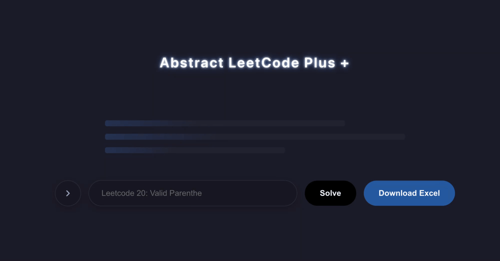

# Abstract-LeetCode-Plus

[English](#english-version) | [简体中文](#中文版本)

---

## English Version




ABSTRACT is an intelligent study and review tool designed specifically for mastering LeetCode questions. It helps users organize, summarize, and retain key problem-solving patterns efficiently. With structured note-taking, spaced repetition, and AI-powered insights, ABSTRACT makes coding interview preparation faster and more effective.

* Contributor: [Jonas Li](yunzhe-li.top) ｜ FreakLu

---

### Table of Contents

- [Abstract-LeetCode-Plus](#abstract-leetcode-plus)
  - [English Version](#english-version)
    - [Table of Contents](#table-of-contents)
    - [Project Architecture](#project-architecture)
    - [Getting Started](#getting-started)
    - [Version History](#version-history)
  - [中文版本](#中文版本)
    - [Table of Contents / 目录](#table-of-contents--目录)
    - [Project Architecture / 项目架构](#project-architecture--项目架构)
    - [Getting Started / 快速启动](#getting-started--快速启动)
    - [Version History / 版本历史](#version-history--版本历史)
    - [v1.1 In progress](#v11-in-progress)

---

### Project Architecture

The project uses a standard Mono-repo structure separating Frontend and Backend:

```text
.
├── backend/               FastAPI backend (Handles LLM client & Excel archiving)
│   ├── leetcode_api/      - API routing and views
│   ├── pipeline/          - LLM client & Markdown parser logic
│   └── data/              - Local Excel solution database
├── frontend/              React frontend (Handles UI & interactive components)
│   ├── src/               - Core application components
│   └── README.md          - Detailed frontend documentation
└── README.md              - Main navigation document
```

---

### Getting Started

1. Backend Service
For detailed server configuration, please refer to Backend Sub-README. Quick start commands:

```Bash
cd backend
pip install -r requirements.txt
uvicorn main:app --reload --port 8000
```

2. Frontend Interface
For detailed frontend configuration, please refer to Frontend Sub-README. Quick start commands:

```Bash
cd frontend
npm install
npm start
```

---

### Version History

v1.1 (Current Version)
[Feat] Added multi-provider support (OpenAI / DeepSeek / SiliconFlow) via environment variables.

[Fix] Relaxed regex parsing to fully support dual-language (English/Chinese) table extractions.

[Enhance] Implemented automatic duplicate checking and dynamic "Last Viewed" date updates in the Excel tracker.

v1.0 (Feb 20, 2025)
Features: Enter one question, abstracts generate the structured question analysis including the question patterns, complexity analysis, and code for the exact best solution.  

Download the question analysis sheet to local for further review.  

Demo Video: YouTube Link  

## 中文版本

ABSTRACT 是一款专为刷 LeetCode 打造的智能学习与复习辅助工具。它能够高效帮助用户梳理、总结并固化核心解题模式。通过结构化的笔记沉淀、渐进式重复记忆算法以及大模型的深度洞察，ABSTRACT 让技术面试的准备过程变得更加高效和精准。

贡献者: [Jonas Li](yunzhe-li.top) ｜ FreakLu

### Table of Contents / 目录

- [Abstract-LeetCode-Plus](#abstract-leetcode-plus)
  - [English Version](#english-version)
    - [Table of Contents](#table-of-contents)
    - [Project Architecture](#project-architecture)
    - [Getting Started](#getting-started)
    - [Version History](#version-history)
  - [中文版本](#中文版本)
    - [Table of Contents / 目录](#table-of-contents--目录)
    - [Project Architecture / 项目架构](#project-architecture--项目架构)
    - [Getting Started / 快速启动](#getting-started--快速启动)
    - [Version History / 版本历史](#version-history--版本历史)
    - [v1.1 In progress](#v11-in-progress)


---

### Project Architecture / 项目架构

项目采用前后端分离的 Mono-repo 管理模式：

```Plaintext
.
├── backend/               FastAPI 后端服务（处理大模型交互与 Excel 题解归档）
│   ├── leetcode_api/      - API 路由与核心业务视图
│   ├── pipeline/          - LLM 客户端与 Markdown 表格提取器
│   └── data/              - 本地生成的 Excel 题解数据库
├── frontend/              React 前端页面（处理交互与用户界面展示）
│   ├── src/               - 前端核心组件与逻辑
│   └── README.md          - 前端详细说明文档
└── README.md              - 本主导航文档
```

---

### Getting Started / 快速启动

1. 后端服务启动
更详细的环境配置请参考 后端子目录说明。快速启动指令：

```Bash
cd backend
pip install -r requirements.txt
uvicorn main:app --reload --port 8000
```

2. 前端界面启动
更详细的前端配置请参考 前端子目录说明。快速启动指令：

```Bash
cd frontend
npm install
npm start
```
---

### Version History / 版本历史

v1.1 (当前版本)
[新功能] 解耦大模型客户端，支持通过环境变量动态切换多厂商模型（OpenAI / DeepSeek / 硅基流动 SiliconFlow）。

[修复] 优化 Markdown 表格解析正则，完美兼容中英文双语题解抓取与自适应归档。

[增强] 本地 Excel 题解支持自动查重，检测到同名题目时自动刷新“上次复习时间（Last Viewed）”而不重复追加。

v1.0 (2025年2月20日)
特性：输入任一题号，自动生成结构化的题目分析，包括考察模式、复杂度分析以及最优解的 Python 代码。

支持将题目分析表一键下载至本地以便离线复习。

演示视频：YouTube 链接

---

### v1.1 In progress

What to expect /  geplant (后续更新计划):

* **Dark Mode / 深色模式**
* **History Sidebar / 历史错题本**
* **UI Overhaul / 排版优化**
* **Local Code  / 本地代码管理**
